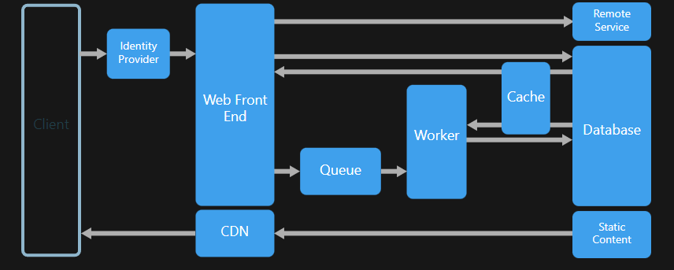

# Stable Diffusion Service (SDS)

---

Architectural Pattern that is used to build a service: **[web-queue-worker](https://learn.microsoft.com/en-us/azure/architecture/guide/architecture-styles/web-queue-worker)**

---

#### Requirements:

---
* Python >= 3.10
* [Docker](https://www.docker.com/get-started/)
* Tranformers 

All the main dependencies and requirements are listed in `requirements.txt` file.

You can simply install all the dependencies via `pip`:

`python3 -m pip install -r requirements.txt`

It is recommended to have at least **16GB of RAM and dedicated GPU with at least 8GB VRAM**. 

For running the service you will also need **Redis server** on your local machine. The easiest way to run Redis is to use Docker container. 

Open terminal and run: 

`$ docker run -d --name worker-redis -p 6379:6379 redis`

After you will finish with exploration do not forget to stop the container

`$ docker stop worker-redis`

---

